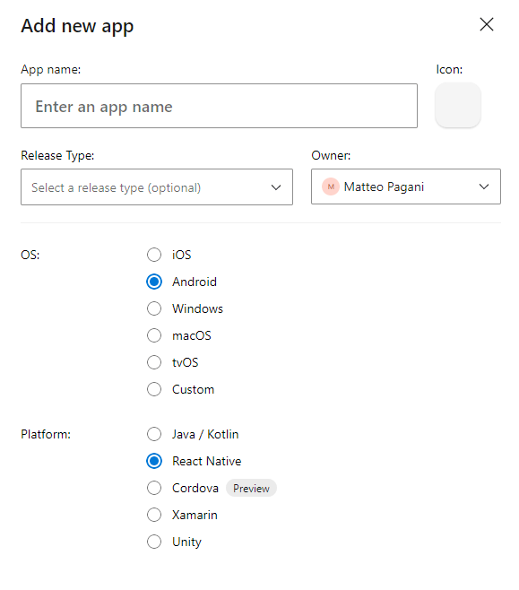
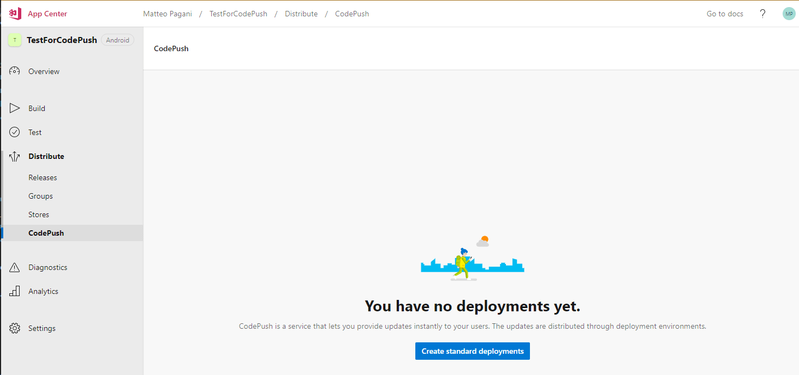
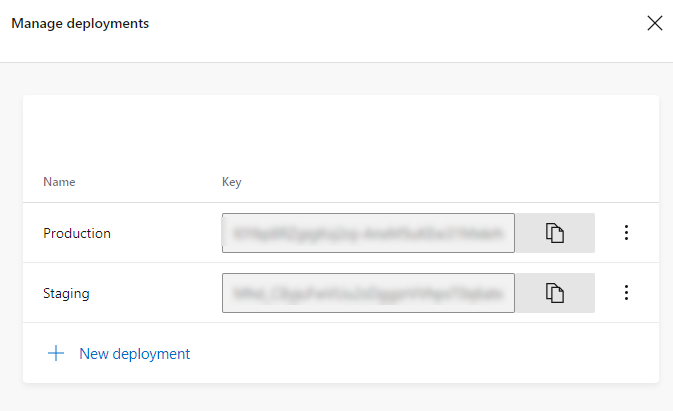
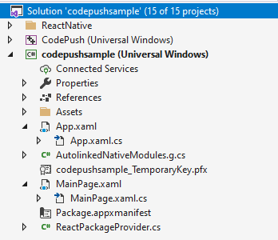
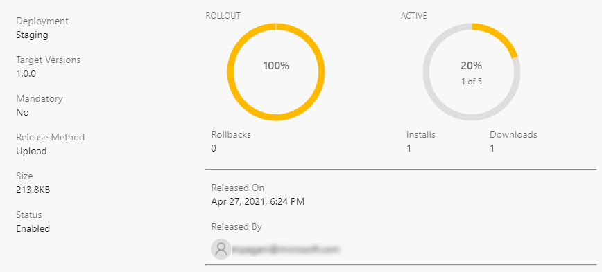
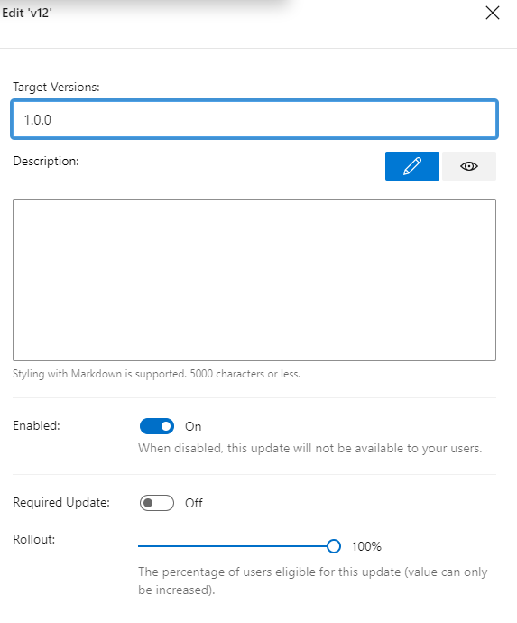
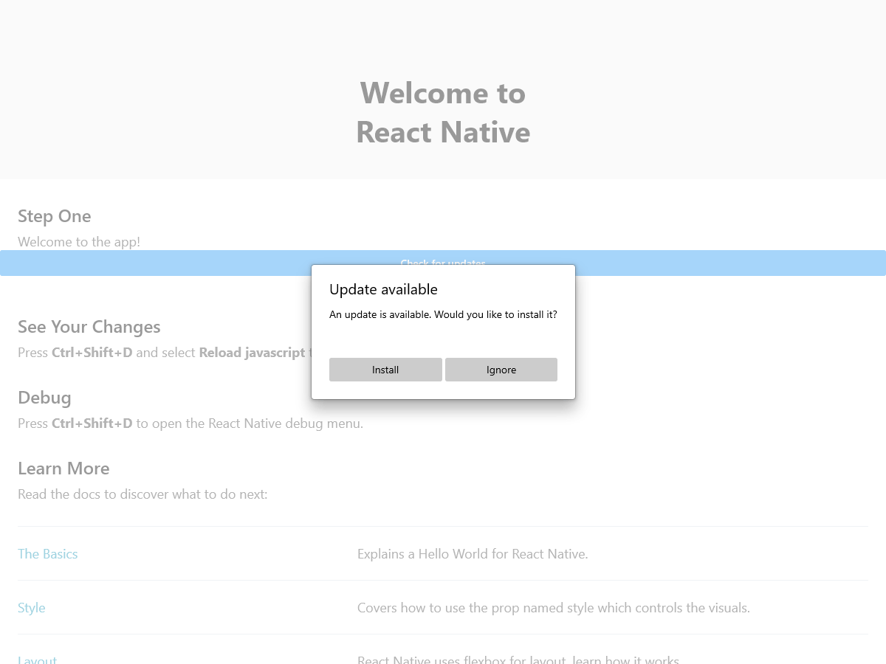

# Using CodePush in a React Native for Windows application
CodePush is a service built by Microsoft, now incorporated into the [Visual Studio App Center platform](https://appcenter.ms/), which provides a way for React Native and Cordova developers to be more agile in delivering updates to their applications.
Thanks to CodePush, you are able to deliver a new bundle (which might contain updated JavaScript files, new images, etc.) without having to fully redeploy a new package. This means, for example, that you can update the content of your application published on a Store without submitting a new package and waiting for the certification process to be completed; or that you can add a new feature in your LOB app without having to redeploy it via Intune or another MDM solution to all your employees.
The only caveat is that **the feature works only for updates which involves the bundle**, which means changes in the JavaScript code, a new asset, etc. If the update involves changes in the binary package (like adding a new capability in the manifest or integrating a new native module), then you are required to submit a new package using the standard approach. 

Enabling Code Push requires to interact with three different layers:

1. App Center, which is the cloud platform that will host and deliver your updates. You're going to push new bundles to App Center using the [App Center CLI](https://docs.microsoft.com/en-us/appcenter/cli/).
2. A native module, which must be integrated in the React Native application.
3. A set of JavaScript APIs, which you must integrate in the JavaScript layer of your application to manage the update lifecycle.

CodePush initially supported only iOS and Android, but [the native module](https://github.com/microsoft/react-native-code-push/) has recently added support for the Windows implementation of React Native as well. However, App Center still lacks support for this technology on Windows and, today, when you create a new Windows application on App Center, React Native isn't one of the available options. This means that the infrastructure needed to support CodePush won't be available. In this article we're going to see how we can configure our Windows application to use Code Push, even if it isn't fully supported by App Center.

## Setting up App Center

The first task is to create a new application in Visual Studio App Center. Thes starting point is the [App Center website](https://appcenter.ms/), where you can login to your dashboard. If you don't already have an account, you can create a free one the first time you login using your Microsoft Account, work account, GitHub, Facebook or Google account.
Once you are logged in, click on **Add new** and choose **Add new app**.

This is the first step where we have to apply a workaround. In this panel, you will be able to setup your application, by specifing the name and the target platform:



However, as previously mentioned, if you choose **Windows** you won't see React Native as an option. As such, we have to trick App Center to think that our Windows application is actually an Android one.

> The process will work also if you choose iOS. Since we won't really use any specific Android or iOS SDK, it doesn't really matter, as long as React Native is a supported platform.

As such, choose **Android** as OS and **React Native** as Platform, then create the application. Since you have chosen React Native, you should see now a section called **CodePush** in the Distribute section:



In CodePush you can configure multiple deployments slot, to manage different versions of the application (production, staging, etc.). By clicking on **Create standard deployments** App Center will create by defaults two environments: Staging and Production. By clicking on the wrench icon at the top, you will be able to add new ones. 
Each environment has a dedicated key, which is required to setup CodePush in the application. For the moment, let's assume that we're going to work with the staging version of the app, so copy the key for that environment and keep it for the next steps.



The last step is to install the App Center CLI, which provides the commands you will need to push the bundle updates to the App Center servers. To install it, open a prompt on your machine and run the following command:

```powershell
npm install -g appcenter-cli
```

Before moving to the next step, run the following command to login with your App Center account and connect the CLI to it:

```powershell
appcenter login
```

Now we can start integrating the SDK in our React Native app.

## Integrating the SDK

The SDK is available as a React Native native module, which fully supports autolinking on Windows as well. As such, the first step is to install the module. Move to the root of your React Native project and run the following command in a terminal:

```powershell
yarn add react-native-code-push
```

The next step is to perform the autolinking. We have to do it manually because, after the module has been linked, we'll have to make some manual changes to the app before being able to build and deploy it. As such, from the same root of the project, run the following command:

```powershell
npx react-native autolink-windows
```

Now open in Visual Studio the solution in the **windows** folder (it will have the same name of your project, plus the .sln extension).
If you have performed the autolinking properly, the solution will look like this:



In the previous image, **codepushsample** is the main application which acts as a React Native host (in this case it's based on C#, but it can be C++ as well), while **CodePush** is the SDK referenced by the main app.
The next step is to change the implementation of the `OnLaunched` event, which takes care of initializing the app. **This is a very important step**: it won't be enough to add the code to initialize CodePush, but you have also to make the below changes in the initialization; otherwise, the application won't behave properly and, most of the times, launching it will result in a blank screen or a frozen app.

If you have opted for an host application based on C# (so you have initialized React Native for Windows with the `--language cs` parameter), you will find the `OnLaunched` implementation in the `App.xaml.cs` file. You will have to replace it with the following code:

```csharp
protected override void OnLaunched(LaunchActivatedEventArgs e)
{
    Microsoft.CodePush.ReactNative.CodePushConfig.SetHost(Host);
    Dictionary<string, string> configMap = new Dictionary<string, string>();
    configMap.Add("appVersion", "1.0.0");
    configMap.Add("deploymentKey", "<deploymentKey>");
    Microsoft.CodePush.ReactNative.CodePushConfig.Init(configMap);

    Frame rootFrame = null;

    var content = Window.Current.Content;
    if (content != null)
    {
        rootFrame = content as Frame;
    }

    if (rootFrame == null)
    {
        rootFrame = new Frame();
        if (e.PreviousExecutionState == ApplicationExecutionState.Terminated)
        {

        }

        if (!e.PrelaunchActivated)
        {
            if (rootFrame.Content == null)
            {
                rootFrame.Navigate(typeof(MainPage), e.Arguments);
            }

            Window.Current.Content = rootFrame;
            Window.Current.Activate();
        }
    }
    else
    {
        if (!e.PrelaunchActivated)
        {
            if (rootFrame.Content == null)
            {
                rootFrame.Navigate(typeof(MainPage), e.Arguments);
            }

            Window.Current.Activate();
        }
    }
}
```

If, instead, you're using a C++ host (the default one), you will find the implementation in the **App.cpp** file. This is the new implementation you have to provide:

```cpp
void App::OnLaunched(activation::LaunchActivatedEventArgs const& e)
{
    winrt::Microsoft::CodePush::ReactNative::CodePushConfig::SetHost(Host());
    auto configMap{ winrt::single_threaded_map<hstring, hstring>() };
    configMap.Insert(L"appVersion", L"1.0.0");
    configMap.Insert(L"deploymentKey", L"<deploymentKey>");
    winrt::Microsoft::CodePush::ReactNative::CodePushConfig::Init(configMap);

    Frame rootFrame{ nullptr };
    auto content = Window::Current().Content();
    if (content)
    {
        rootFrame = content.try_as<Frame>();
    }

    // Do not repeat app initialization when the Window already has content,
    // just ensure that the window is active
    if (rootFrame == nullptr)
    {
        // Create a Frame to act as the navigation context and associate it with
        // a SuspensionManager key
        rootFrame = Frame();

        rootFrame.NavigationFailed({ this, &App::OnNavigationFailed });

        if (e.PreviousExecutionState() == ApplicationExecutionState::Terminated)
        {
            // Restore the saved session state only when appropriate, scheduling the
            // final launch steps after the restore is complete
        }

        if (e.PrelaunchActivated() == false)
        {
            if (rootFrame.Content() == nullptr)
            {
                // When the navigation stack isn't restored navigate to the first page,
                // configuring the new page by passing required information as a navigation
                // parameter
                rootFrame.Navigate(xaml_typename<CodePushDemoAppCpp::MainPage>(), box_value(e.Arguments()));
            }
            // Place the frame in the current Window
            Window::Current().Content(rootFrame);
            // Ensure the current window is active
            Window::Current().Activate();
        }
    }
    else
    {
        if (e.PrelaunchActivated() == false)
        {
            if (rootFrame.Content() == nullptr)
            {
                // When the navigation stack isn't restored navigate to the first page,
                // configuring the new page by passing required information as a navigation
                // parameter
                rootFrame.Navigate(xaml_typename<CodePushDemoAppCpp::MainPage>(), box_value(e.Arguments()));
            }
            // Ensure the current window is active
            Window::Current().Activate();
        }
    }
}
```

You can copy and paste both snippets of code as they are. The only change to apply is in the first lines, where the CodePush initialization happens:

```csharp
Microsoft.CodePush.ReactNative.CodePushConfig.SetHost(Host);
Dictionary<string, string> configMap = new Dictionary<string, string>();
configMap.Add("appVersion", "1.0.0");
configMap.Add("deploymentKey", "<deploymentKey>");
Microsoft.CodePush.ReactNative.CodePushConfig.Init(configMap);
```

`appVersion` is the version number of the application and it's used to determine if CodePush should deliver an update or not for this version. When you publish a bundle on CodePush, in fact, you can specify which is the version of the application the bundle refers to, so that only users with that version will receive the update. `deploymentKey`, instead, is the key we have previously retrieved from App Center.

That's it. Now you can deploy and run the application like a normal React Native for Windows application. You won't see any changes for the moment. 
However, be aware that, in order to test the implementation, **you won't be able to use a debug version of the app**, but you will have to generate a release AppX / MSIX package and deploy it on your machine.
The reason is that, when you're debugging a React Native application, the Metro packager is always up & running. As such, any change you're going to make to the JavaScript layer will be automatically pushed to the host app and displayed in real time, without giving you the possibility to push it as an update via CodePush.

To generate a relase version of the package, you can follow [this guidance](https://microsoft.github.io/react-native-windows/docs/getting-started#building-a-standalone-react-native-windows-app).

## Integrating the JavaScript APIs

Now we are ready to start setting up CodePush in the JavaScript layer of the application. The key to enable it is to wrap the main `App` class or function (based on the approach you're using) inside the `codePush` one, like in the following examples:

```javascript
//class component
import codePush from "react-native-code-push";

class App extends Component {
    //your app component
}

App = codePush(App);

export default App;

//functional component
import codePush from "react-native-code-push";

let App: () => React$Node = () => {
    //your app component
}

App = codePush(App);

export default App;
```

With this basic configuration you enable the default behavior: CodePush will search for updates when the application starts and, if they're available, it will download them silently and apply them at the next restart.
Let's try it. As first step, after you have wrapped your application in the `codePush` function, you will have to generate, through Visual Studio, a new MSIX / AppX package compiled in Release mode and then install it on your machine.
Once you have it, you can start making changes to your application. Feel free to change anything which involves the JavaScript layer: a text, a style, a component, etc.

Once you have made the change, you will need to create a new bundle and release it on CodePush. If you follow the official guidance, you'll find that the App Center CLI has a special command called `release-react` which automatically takes care of generating the bundle and pushing it to CodePush. However, at the time of writing, the App Center CLI doesn't support Windows as a platform yet. As such, the `release-react` will generate an incorrect bundle: since, in App Center, you have configured this app as an Android app, it will generate an Android bundle.

The workaround is to manually generate the bundle for Windows and then manually upload it to CodePush, using the `release` command. Let's start with the first step. Open a terminal on the root of your project and create a folder called `Bundle` to store it:

```powershell
mkdir Bundle
```

Then run the following command:

```powershell
npx --no-install react-native bundle --platform windows --entry-file index.js --bundle-output ./Bundle/index.windows.bundle --assets-dest ./Bundle --dev false --reset-cache
```

This is the same command that Visual Studio runs when you generate a release package for the Windows application.
Now you can push it to App Center using the App Center CLI with the following command:

```powershell
appcenter codepush release -a mpagani/CodePushSample -c .\Bundle -t 1.0.0
```

This is the meaning of the various parameters:

- `-a` is the identifier of application you have registed on App Center. The parameter is made by the name of your account / the name of the application. You can find them in your URL of your browser, when you have the dashboard opened on the app:

    

- `-c` is the path which contains the bundle you want to publish. In our case, it's the `Bundle` folder which we have previously created.
- `-t` is the version number of the app this bundle refers to.

After a few seconds, you should see a confirmation that the bundle has been succesfully uploaded. You can check that the operation was succesfull by logging in to the App Center dashboard of your application. You should see all the releases you have published in the CodePush section:


You will be able to see different statistics about each release, like the number of users who have downloaded and installed the update:



Now you should be able to see CodePush in action by following these steps:

1. Open the application you have previously packaged and deployed.
2. You will see the original version of the application. However, in background, CodePush will have started to download the new bundle.
3. Close and reopen the application.
4. Now you should see the new version of the application, with the changes you have applied.

### Configure the update
When you use the CLI, you can also configure how the update should behave with different parameters. For example, if it's a mandatory update (so the user can't ignore it or postpone it), you can use the `--mandatory` parameter:

```powershell
appcenter codepush release -a mpagani/CodePushSample -c .\Bundle -t 1.0.0 --mandatory
```

Alternatively, if you want to enable a gradual rollout, you can use the `--rollout` parameter with a number between 1 and 100, which represents the percentage of users that will receive the update immediately:

```powershell
appcenter codepush release -a mpagani/CodePushSample -c .\Bundle -t 1.0.0 --rollout 25
```

You can find all the parameters documented [here](https://github.com/microsoft/code-push/tree/v3.0.1/cli#releasing-updates-general). In case you have already pushed an update and you want to change its configuration, you can use the App Center dashboard. By clicking on the wrench icon inside a release page, you will be able to customize it:



## Customizing the update behavior

The CodePush APIs give you lot of flexibility in deciding how you want to manage updates. The previous implementation you have tested is the default one, but there are other alternatives.

### Show a prompt to the user

With this approach, the check for updates still happens when the application starts, but the package won't be automatically downloaded and installed. The user will be prompted if they want to move on or cancel it (unless it was marked as mandatory when you have published the bundle).



To achieve this goal, you can pass the following options when you initialize the `codePush` function:

```javascript
import codePush from "react-native-code-push";

let App: () => React$Node = () => {
    //your app component
}

App = codePush({ updateDialog: true, installMode: codePush.InstallMode.IMMEDIATE })(App);

export default App;
```

### Handle updates manually

You can also choose to disable automatic updates and provide a manual way to the user to check and install them, for example via a button. The first step is to pass `CheckFrequency.MANUAL` as option in the `codePush()` function to disable automatic updates:

```javascript
import codePush from "react-native-code-push";

let App: () => React$Node = () => {
    //your app component
}

App = codePush({ checkFrequency: codePush.CheckFrequency.MANUAL })(App);

export default App;
```

Then you can use use the `sync()` function provided by the CodePush APIs to manually trigger the update check. You can call this function, for example, when a button is pressed:

```javascript
const onCheckUpdates = async () => {
  var result = await codePush.sync({
      updateDialog: true,
      installMode: codePush.InstallMode.IMMEDIATE
  });
}
```

### Track the download progress

CodePush provides a series of events to track the status of the installation. The only caveat is that, at the moment of writing, they are exposed only through class components.
This is an example of the implementation:

```javascript
class App extends React.Component {
    codePushStatusDidChange(status) {
        switch(status) {
            case codePush.SyncStatus.CHECKING_FOR_UPDATE:
                console.log("Checking for updates.");
                break;
            case codePush.SyncStatus.DOWNLOADING_PACKAGE:
                console.log("Downloading update.");
                break;
            case codePush.SyncStatus.INSTALLING_UPDATE:
                console.log("Installing update.");
                break;
            case codePush.SyncStatus.UP_TO_DATE:
                console.log("Your app is up-to-date.");
                break;
            case codePush.SyncStatus.UPDATE_INSTALLED:
                console.log("Update installed.");
                break;
        }
    }

    codePushDownloadDidProgress(progress) {
        console.log(progress.receivedBytes + " of " + progress.totalBytes + " received.");
    }
}
App = codePush(MyApp);
export default App;
```

The `codePushStatusDidChange()` event is raised when the status of the update changes. It can assume one of the values exposed by the `SyncStatus` enumerator. The `codePushDownloadDidProgress()` event, instead, is raised when the download has started and, through the `progress` object, you can get the current status, in case you want to display a progress bar or another similar control.

## Wrapping up

Thanks to CodePush, you can be more agile in keeping your application up-to-date and deliver new features without having to redeploy a completely new package. Currently, App Center doesn't fully support the React Native for Windows implementation, but with a few workarounds you can still leverage it. I highly invite you to read [the whole README of the main repository](https://github.com/microsoft/react-native-code-push/blob/master/README.md), since it contains many additional information for advanced scenarios, like how to handle Store policies, how to manage multiple deployment assignments, etc.
[Here](https://github.com/microsoft/react-native-code-push/blob/master/docs/api-js.md), instead, you can find an overview of the JavaScript APIs, with many details on how to customize the update experience.
If you're looking for an example with a C++ based host app, you can refer to [the official one](https://github.com/microsoft/react-native-code-push/tree/master/Examples/CodePushDemoApp). A C# version of the sample, instead, can be found [here](https://github.com/qmatteoq/CodePushSample).

Happy coding!

